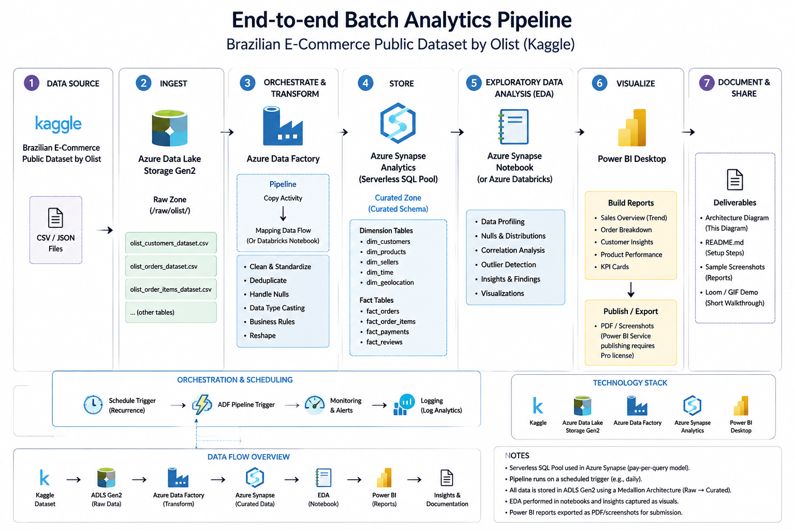
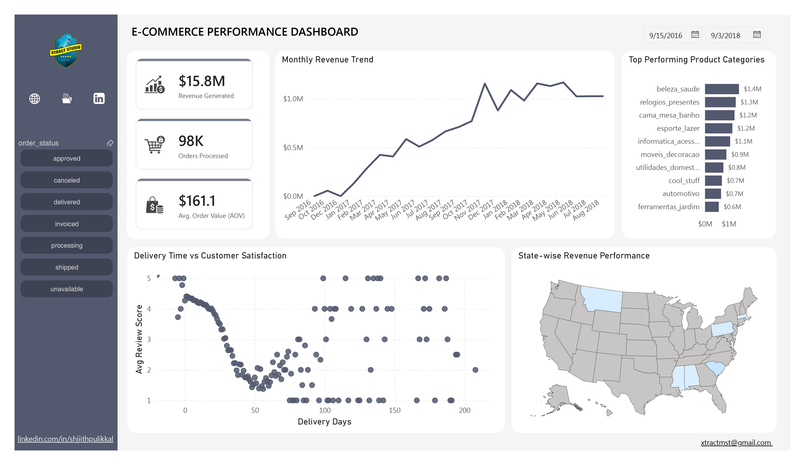

# E-Commerce Analytics Pipeline on Azure

An end-to-end batch analytics pipeline built on Azure that ingests raw e-commerce transaction data, transforms it through a medallion architecture (raw → staging → curated), and delivers business-ready insights through Power BI.



---

## 📌 Problem Statement

<!-- Write 2-4 sentences here. Example: -->
E-commerce businesses generate transactional data across multiple disconnected systems (orders, payments, products, customers, reviews). This project builds a cloud data pipeline that consolidates the Olist Brazilian e-commerce dataset into a single analytics-ready model, answering questions like: *Which product categories drive the most revenue? How does delivery time affect customer satisfaction? Where are our customers concentrated?*

---

## 🏗️ Architecture

```
Raw CSVs → ADLS Gen2 (raw/) → Azure Data Factory (Copy + Data Flow) → ADLS Gen2 (staging/, Parquet) 
→ Azure Synapse Serverless SQL (views over curated data) → Power BI Dashboard
```

**Design pattern:** Medallion architecture (raw → staging → curated) — a standard pattern for reliable, reproducible data pipelines that separates untouched source data from cleaned, analytics-ready output.

---

## 🛠️ Tech Stack

| Service | Purpose |
|---|---|
| **Azure Data Lake Storage Gen2** | Hierarchical data lake storing raw, staging, and curated data layers |
| **Azure Data Factory** | Orchestrates ingestion (Copy Activity) and transformation (Mapping Data Flow) |
| **Azure Synapse Analytics (Serverless SQL Pool)** | Queries curated Parquet files directly from the lake, no data loading/ETL into a warehouse required |
| **Synapse Notebook (PySpark)** | Exploratory Data Analysis on the curated dataset |
| **Power BI Desktop** | Final dashboard and visual reporting layer |

**Why serverless over dedicated SQL pools:** Serverless bills per TB of data scanned rather than per hour of compute uptime — the right choice for a project-scale dataset and for keeping cloud costs near-zero when idle.

---

## 📊 Key EDA Findings

<!-- Replace with your actual findings from the notebook. Example structure: -->
- Revenue is heavily concentrated in a small number of product categories — the top 5 categories account for **[X]%** of total revenue.
- Order volume shows a clear seasonal pattern, peaking around **[month/period]**.
- There's a measurable relationship between delivery time and review score: orders delivered in under **[X] days** average a **[Y]-star** rating, compared to **[Z]-star** for late deliveries.
- **[X]%** of orders originate from **[state/region]**, showing strong geographic concentration.

*(Full analysis with charts: [`notebooks/Synapse_EDA_Notebook.ipynb`](./notebooks/Synapse_EDA_Notebook.ipynb))*

---

## 📈 Dashboard



The dashboard answers:
- What's our total revenue, order volume, and average order value?
- Which product categories and regions drive the most revenue?
- How does delivery performance correlate with customer satisfaction?

*(Full report: [`dashboards/dashboard.pdf`](./dashboards/dashboard.pdf))*

---

## 🔁 How to Reproduce

1. **Provision infrastructure** — deploy the ARM template in [`infra/adf-pipeline-arm-template.json`](./infra/adf-pipeline-arm-template.json), or manually create a Resource Group, ADLS Gen2 storage account, Azure Data Factory, and Synapse workspace (serverless SQL pool).
2. **Upload raw data** — run [`scripts/upload_raw_data.py`](./scripts/upload_raw_data.py) to push the source CSVs into the `raw/` container. (Dataset: [Olist Brazilian E-Commerce](https://www.kaggle.com/datasets/olistbr/brazilian-ecommerce), not included in this repo due to size — see Data section below.)
3. **Run the ADF pipeline** — import and trigger `pl_ecommerce_ingest_transform` to copy and transform raw data into `staging/` as Parquet.
4. **Query in Synapse** — run [`sql/curated_sales_view.sql`](./sql/curated_sales_view.sql) in the serverless SQL pool to create the analytics view.
5. **Explore the data** — open [`notebooks/eda_ecommerce.ipynb`](./notebooks/eda_ecommerce.ipynb) in a Synapse or Databricks notebook.
6. **Build the dashboard** — connect Power BI Desktop to the Synapse serverless SQL endpoint and load `vw_curated_sales`.

### 📁 Data

The raw dataset isn't committed to this repo (large CSVs, licensing). Download it directly from [Kaggle: Brazilian E-Commerce by Olist](https://www.kaggle.com/datasets/olistbr/brazilian-ecommerce) and place the files under a local `ecommerce-data/` folder before running the upload script.

---

## 📂 Repo Structure

```
azure-ecommerce-analytics-pipeline/
├── README.md
├── architecture-diagram.png
├── infra/
│   └── adf-pipeline-arm-template.json
├── scripts/
│   └── upload_raw_data.sh
├── notebooks/
│   └── eda_ecommerce.ipynb
├── sql/
│   └── curated_sales_view.sql
└── dashboard/
    ├── ecommerce_dashboard.pdf
    └── screenshots/
```

---

## 💡 What I'd Do Differently at Scale

- Switch from full-load Copy activities to **incremental loading** using a watermark column (e.g. `order_purchase_timestamp`), so the pipeline only processes new/changed records instead of reprocessing the full dataset each run.
- Move to a **dedicated Synapse SQL pool** or Delta Lake table format once data volume and query concurrency grow beyond what serverless can serve cost-effectively.
- Add **data quality checks** (e.g. Great Expectations, or ADF's own validation activities) as a gate before data lands in `curated/`.
- Publish the Power BI report to the **Power BI Service** with a scheduled refresh, rather than static PDF exports.

---


<!-- Add if relevant, e.g. MIT license for your code; note the dataset has its own license from Kaggle/Olist -->
