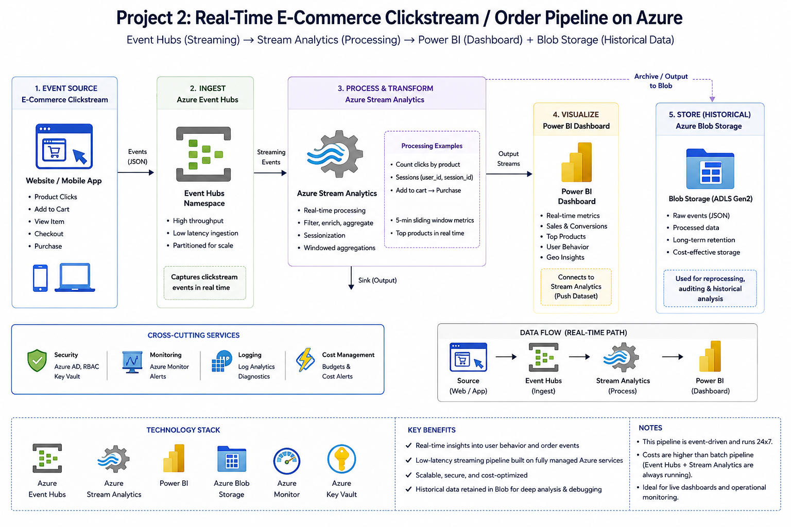
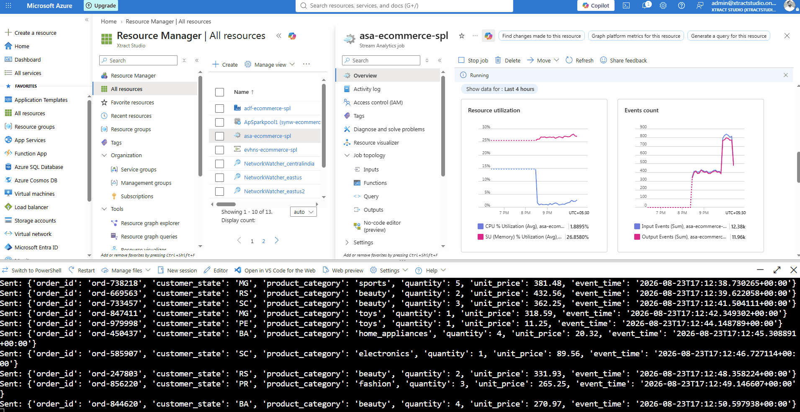

# Real-Time E-Commerce Order Pipeline on Azure

A near-real-time streaming pipeline that ingests simulated e-commerce order events, processes them with windowed aggregations, and pushes live metrics to a Power BI dashboard — with raw events archived to a data lake for later historical analysis.





---

## 📌 Problem Statement

<!-- Example, edit to match your actual framing: -->
Batch pipelines answer "what happened yesterday" — but operational teams often need to know "what's happening right now." This project builds an event-driven pipeline that ingests a live stream of order events and surfaces revenue and order-volume metrics on a dashboard that updates within seconds, while still preserving raw events for historical analysis. It's a companion piece to my [batch analytics pipeline](../azure-ecommerce-analytics-pipeline) — same domain (e-commerce), different processing paradigm (streaming vs. batch).

---

## 🏗️ Architecture

```
Producer (Python) → Azure Event Hubs → Azure Stream Analytics (tumbling window aggregation)
                                              ├──→ ADLS Gen2 / Blob (raw event archive, JSON)
                                              └──→ Power BI (live streaming dashboard)
```

**Design pattern:** Event-driven streaming with a fan-out from a single Stream Analytics job to two sinks — one for durable historical storage, one for live visualization. This mirrors a common production pattern where the same stream feeds both operational dashboards and downstream batch/analytics systems.

---

## 🛠️ Tech Stack

| Service | Purpose |
|---|---|
| **Python + `azure-eventhub` SDK** | Simulates a live stream of e-commerce order events |
| **Azure Event Hubs** | Ingests high-throughput event data (Basic tier) |
| **Azure Stream Analytics** | Runs a continuous SQL-like query with tumbling window aggregation over the event stream |
| **Azure Data Lake Storage Gen2** | Archives raw, unaggregated events for historical/batch analysis |
| **Power BI (streaming dataset)** | Live dashboard, auto-refreshing as new aggregated data arrives |

**Why a tumbling window:** Aggregating every 10 seconds keeps the dashboard responsive while avoiding the overhead of publishing every single raw event to Power BI — a standard tradeoff in streaming systems between latency and update volume.

---

## 📊 What the Dashboard Shows

- **Live order count / revenue** — updates automatically as events stream in
- **Revenue by product category** — which categories are trending in near-real-time
- **Orders by customer state** — geographic distribution of live order activity

See the demo GIF above, or the full recording: [`dashboard/live-demo.gif`](./dashboard/live-demo.gif)

---

## 🔁 How to Reproduce

1. **Provision infrastructure** — create a Resource Group, Event Hubs Namespace + Event Hub (Basic tier), and a Stream Analytics job. 
2. **Set your Event Hub connection string as an environment variable** — never hardcode it:
   ```bash
   export EVENTHUB_CONNECTION_STRING="<your-connection-string>"
   ```
3. **Run the producer** to start streaming simulated order events:
   ```bash
   pip install azure-eventhub
   python producer/producer.py
   ```
4. **Deploy the Stream Analytics query** — copy [`stream-analytics/query.sql`](./stream-analytics/query.sql) into your job's Query editor, with inputs/outputs configured as described in the query comments.
5. **Start the Stream Analytics job** from the Azure Portal.
6. **View the live dashboard** in Power BI by connecting to the job's Power BI output dataset.

> ⚠️ **Cost note:** Event Hubs and Stream Analytics bill while running, not per query. If you're reproducing this yourself, stop the Stream Analytics job and delete the resource group as soon as you're done testing.

---

## 📂 Repo Structure

```
azure-ecommerce-streaming-pipeline/
├── README.md
├── architecture-diagram.png
├── producer/
│   └── producer.py
├── stream-analytics/
│   └── query.sql
└── dashboard/
    ├── live-demo.gif
    └── screenshots/
```

---

## 💡 What I'd Do Differently at Scale

- Replace the Python simulator with a **real event source** (e.g. website click events via a JavaScript SDK, or IoT device telemetry).
- Add a **dead-letter/error-handling path** in Stream Analytics for malformed events instead of relying on the default drop policy.
- Use **Event Hubs Capture** to automatically archive raw events to storage, rather than relying on Stream Analytics to do double duty as the archival mechanism.
- Move to **Azure Stream Analytics with reference data joins** (e.g. joining live orders against a product catalog) to enrich events in-flight.
- Consider **Azure Managed Grafana** or a custom real-time web dashboard for sub-second visualization needs beyond what Power BI's streaming tiles support.

---

## 🔗 Related Project

This pairs with my batch pipeline project: **[Azure E-Commerce Analytics Pipeline](https://github.com/shijithpulikkal/azure-ecommerce-analytics-pipeline)** — same dataset domain, demonstrating the batch side (ADF, Synapse, EDA) of the same problem space.

---


<!-- Add if relevant -->
